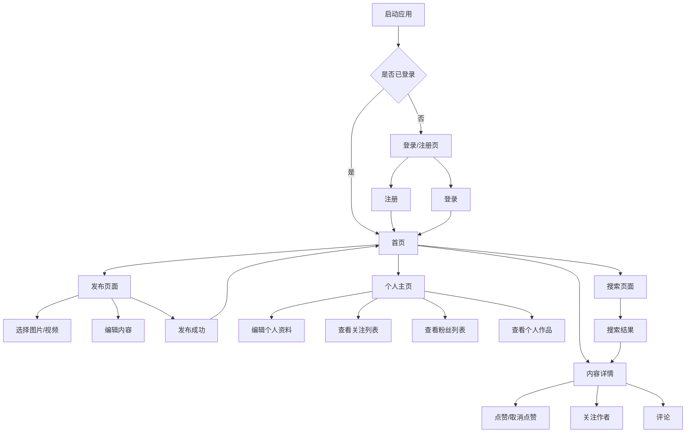

          
我需要基于后端API文档和小红书网站设计一个类似的小紫书应用。首先查看项目结构了解当前状态，然后分析API接口功能，最后设计完整的UI界面和交互流程。
        
            
toolName: view_folder
            
status: success
          
d:\repo\purple_note_frontend\purple_note
          
查看项目的基本配置文件，了解技术栈和项目结构。
        
            
toolName: view_files
            
status: success
          
            
filePath: d:\repo\purple_note_frontend\purple_note\package.json
d:\repo\purple_note_frontend\purple_note\src\App.vue
          
# 小紫书 UI 设计稿与交互说明

基于您提供的后端API文档和小红书网站参考，我为小紫书应用设计了完整的UI界面和交互流程。

## 技术栈
- 前端：Vue 3 + Vite
- 后端API：Spring Boot (基于OpenAPI文档)
- 服务器：http://localhost:8080

## 核心功能模块

### 1. 用户模块
- 用户注册/登录
- 个人主页查看/编辑
- 头像上传

### 2. 内容模块
- 内容发布（支持媒体上传）
- 内容浏览（分页）
- 内容详情查看
- 内容编辑/删除

### 3. 点赞模块
- 内容点赞/取消点赞
- 点赞状态查询
- 用户点赞列表
- 点赞排行榜

### 4. 关注模块
- 关注/取消关注用户
- 关注状态查询
- 关注列表/粉丝列表
- 共同关注
- 关注数/粉丝数统计

## UI 设计稿

### 主界面布局
```
┌─────────────────────────────────────┐
│           小紫书 Logo               │
├─────────────────────────────────────┤
│  🏠首页  🔍发现  ➕发布  💝消息  👤我的  │
├─────────────────────────────────────┤
│                                     │
│         内容瀑布流区域               │
│  ┌─────────┐  ┌─────────┐          │
│  │  图片   │  │  图片   │          │
│  │  内容   │  │  内容   │          │
│  │ 👤作者   │  │ 👤作者   │          │
│  │ ❤️点赞   │  │ ❤️点赞   │          │
│  └─────────┘  └─────────┘          │
│                                     │
└─────────────────────────────────────┘
```

### 页面结构设计

#### 1. 登录/注册页面
```
┌─────────────────────────────────────┐
│              小紫书                 │
│           发现生活之美               │
├─────────────────────────────────────┤
│                                     │
│     ┌─────────────────────┐         │
│     │    用户名/邮箱      │         │
│     └─────────────────────┘         │
│     ┌─────────────────────┐         │
│     │       密码          │         │
│     └─────────────────────┘         │
│                                     │
│     ┌─────────────────────┐         │
│     │       登录          │         │
│     └─────────────────────┘         │
│                                     │
│          还没有账号？注册            │
└─────────────────────────────────────┘
```

#### 2. 首页内容流
```
┌─────────────────────────────────────┐
│  🔍搜索框                    🔔通知  │
├─────────────────────────────────────┤
│                                     │
│  ┌─────────────────────────────────┐ │
│  │ 👤 用户头像  用户名    ➕关注    │ │
│  │                                 │ │
│  │     📷 内容图片/视频             │ │
│  │                                 │ │
│  │     📝 内容描述文字              │ │
│  │     #标签1 #标签2               │ │
│  │                                 │ │
│  │  ❤️123  💬45  🔗分享  ⭐收藏     │ │
│  └─────────────────────────────────┘ │
│                                     │
│  ┌─────────────────────────────────┐ │
│  │        下一条内容...             │ │
│  └─────────────────────────────────┘ │
└─────────────────────────────────────┘
```

#### 3. 发布页面
```
┌─────────────────────────────────────┐
│  ❌取消              发布 ✅         │
├─────────────────────────────────────┤
│                                     │
│  ┌─────────────────────────────────┐ │
│  │                                 │ │
│  │        📷 添加图片/视频          │ │
│  │         (最多9张)               │ │
│  │                                 │ │
│  └─────────────────────────────────┘ │
│                                     │
│  ┌─────────────────────────────────┐ │
│  │  📝 分享你的生活...              │ │
│  │                                 │ │
│  │                                 │ │
│  └─────────────────────────────────┘ │
│                                     │
│  🏷️ 添加标签                        │
│  📍 添加位置                        │
│  👥 @提及朋友                       │
└─────────────────────────────────────┘
```

#### 4. 个人主页
```
┌─────────────────────────────────────┐
│  ⬅️返回              ⚙️设置         │
├─────────────────────────────────────┤
│                                     │
│      👤 大头像                      │
│         用户名                      │
│       个人简介...                   │
│                                     │
│   123     456     789              │
│   笔记    关注    粉丝              │
│                                     │
│  ┌─────┐ ┌─────┐ ┌─────┐           │
│  │编辑  │ │关注  │ │私信  │           │
│  │资料  │ │     │ │     │           │
│  └─────┘ └─────┘ └─────┘           │
│                                     │
│  ┌─────────────────────────────────┐ │
│  │  📝笔记  ❤️点赞  ⭐收藏         │ │
│  └─────────────────────────────────┘ │
│                                     │
│  内容网格展示...                    │
└─────────────────────────────────────┘
```

## 页面流程图



## 交互说明

### 1. 首页交互
- **下拉刷新**：获取最新内容
- **上拉加载**：分页加载更多内容
- **双击点赞**：快速点赞内容
- **长按预览**：预览内容详情
- **左滑操作**：收藏/分享快捷操作

### 2. 内容发布交互
- **拖拽排序**：调整图片顺序
- **实时预览**：编辑时实时预览效果
- **自动保存**：草稿自动保存
- **标签联想**：输入#自动联想标签

### 3. 个人主页交互
- **头像点击**：查看大图
- **关注按钮**：关注/取消关注动画
- **内容网格**：瀑布流/网格切换
- **筛选标签**：按类型筛选内容

### 4. 搜索交互
- **热门搜索**：显示热门搜索词
- **搜索历史**：保存搜索历史
- **实时搜索**：输入时实时显示建议
- **搜索结果**：支持按时间/热度排序

## API 接口映射

### 用户相关
- `POST /users/register` - 用户注册
- `POST /users/login` - 用户登录
- `GET /users/profile` - 获取个人资料
- `PUT /users/profile` - 更新个人资料
- `POST /users/upload/avatar` - 上传头像

### 内容相关
- `POST /contents` - 发布内容
- `PUT /contents` - 更新内容
- `GET /contents/{id}` - 获取内容详情
- `DELETE /contents/{id}` - 删除内容
- `GET /contents/page` - 分页获取内容
- `POST /contents/upload/media` - 上传媒体文件

### 点赞相关
- `POST /likes/{contentId}` - 点赞内容
- `DELETE /likes/{contentId}` - 取消点赞
- `GET /likes/status/{contentId}` - 获取点赞状态
- `GET /likes/users/{userId}` - 获取用户点赞列表
- `GET /likes/rank` - 获取点赞排行榜

### 关注相关
- `POST /follows/{followedId}` - 关注用户
- `DELETE /follows/{followedId}` - 取消关注
- `GET /follows/isFollow/{followedId}` - 获取关注状态
- `GET /follows/users/{userId}/following` - 获取关注列表
- `GET /follows/users/{userId}/followers` - 获取粉丝列表
- `GET /follows/{userId}/following/count` - 获取关注数
- `GET /follows/{userId}/followers/count` - 获取粉丝数
- `GET /follows/mutual/{targetUserId}` - 获取共同关注

## 设计规范

### 色彩方案
- **主色调**：紫色系 (#8B5CF6)
- **辅助色**：粉色系 (#EC4899)
- **背景色**：白色/浅灰 (#F9FAFB)
- **文字色**：深灰 (#374151)
- **边框色**：浅灰 (#E5E7EB)

### 字体规范
- **标题**：18px-24px，加粗
- **正文**：14px-16px，常规
- **辅助文字**：12px，浅色
- **按钮文字**：14px-16px，加粗

### 间距规范
- **页面边距**：16px
- **组件间距**：12px
- **内容间距**：8px
- **按钮内边距**：12px 24px

### 圆角规范
- **卡片圆角**：12px
- **按钮圆角**：8px
- **头像圆角**：50%（圆形）
- **图片圆角**：8px

这个设计方案完整覆盖了后端API的所有功能，参考了小红书的界面风格，同时具有自己的特色。UI设计简洁现代，交互流畅自然，适合移动端使用。
        